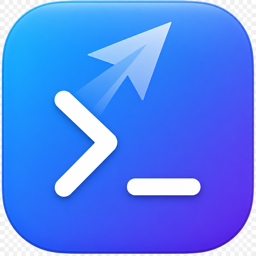
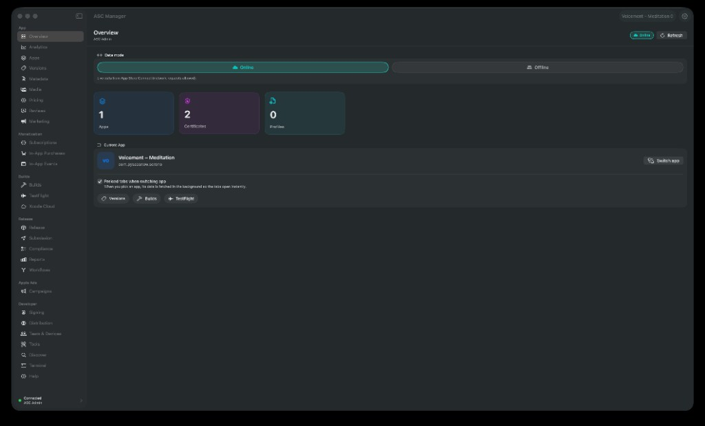
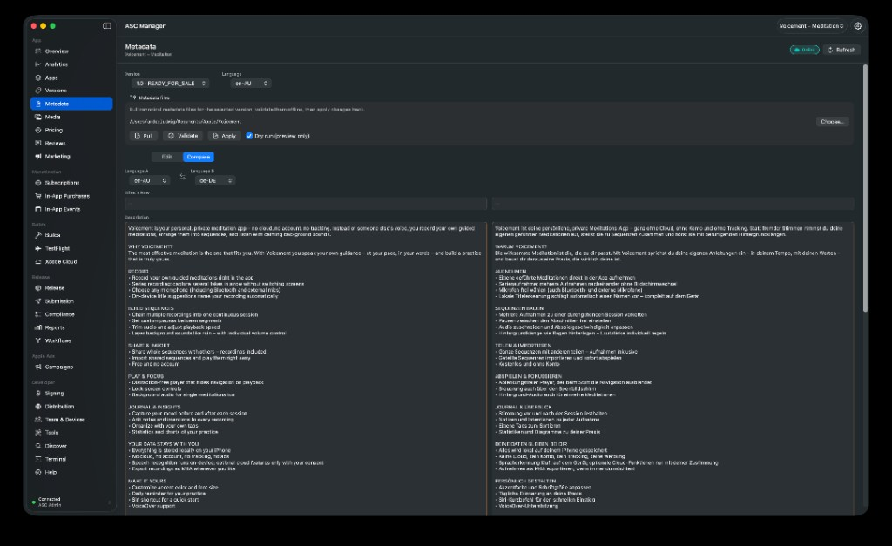
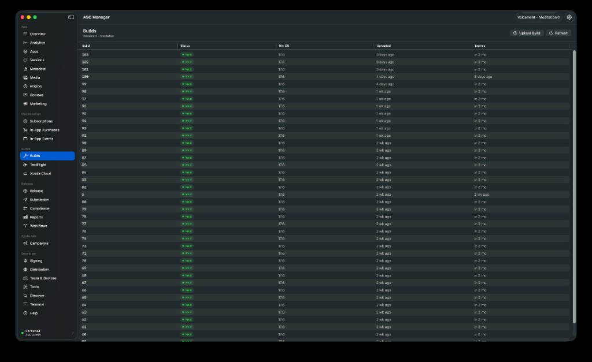
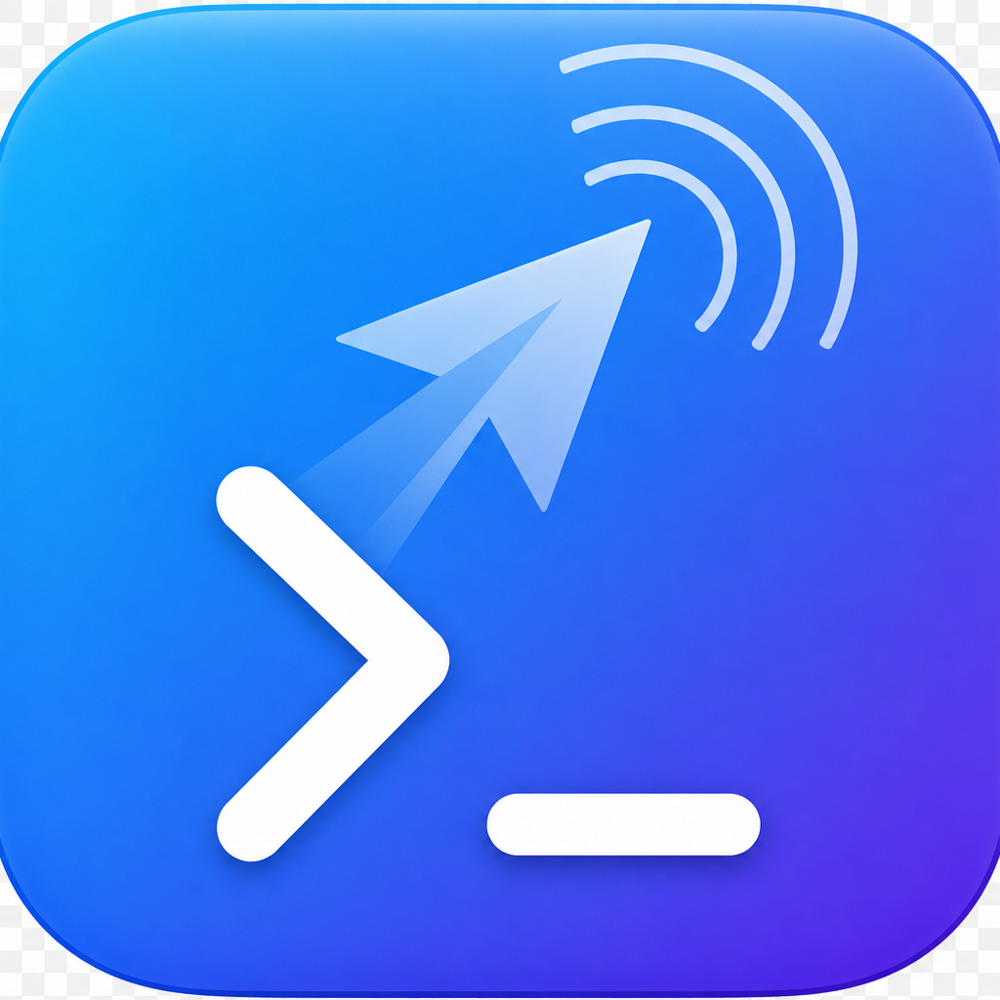

<div align="center">



# ASC Manager

**A native macOS UI for the [`asc`](https://asccli.sh/) App Store Connect CLI.**

Manage apps, builds, TestFlight, versions, metadata, releases, and reports —
without memorizing a single command.

[Screenshots](#screenshots) · [Features](#features) · [Requirements](#requirements) · [Getting started](#getting-started) · [Contributing](#contributing) · [License](#license)

</div>

---

ASC Manager is a SwiftUI app that drives the `asc` command-line tool under the hood.
It turns App Store Connect workflows into a clean, native interface — with a built-in
manual, English/German localization, and a guided first-run setup so you can get
productive without touching the terminal.

> **Bring your own credentials.** ASC Manager never stores your API keys. They live in
> your macOS keychain (managed by `asc`); the app just picks which profile to use.

## Screenshots

**Overview** — dashboard with a global online/offline data mode, the current app, and key counts.



**Metadata** — compare a version's localizations side by side, and pull / validate / apply canonical files.



**Builds** — every build with status, minimum OS, upload date, and expiry.



## Features

The sidebar is grouped into **App**, **Builds**, **Release**, and **Developer**.

**App**
- **Overview** – dashboard with apps, certificates, and profiles at a glance.
- **Apps** – searchable list; sets the active app for app-scoped sections.
- **Versions** – App Store versions with status badges.
- **Metadata** – edit a version's localized metadata (description, keywords, what's new,
  promotional text, support/marketing URLs) per language, **plus** pull/validate/apply
  canonical metadata files across locales.
- **Media** – list, upload, and download App Store **screenshots** and **app preview videos**
  per device type and locale.

**Builds**
- **Builds** – builds with processing-state badges and an **IPA/PKG upload** flow (with dry-run).
- **TestFlight** – parsed beta-group and tester tables, feedback, and notify-testers.
- **Xcode Cloud** – trigger workflows, wait for completion, and check build-run status.

**Release**
- **Release** – release pipeline status (`asc status`), readiness checks (`asc validate`),
  a **Publish** flow (`asc publish appstore`: upload + attach + optional submit, with dry-run),
  an "Open in App Store Connect" link, and developer-release for pending versions.
- **Reports** – analytics requests, sales summaries, and finance reports with a chosen
  **save folder**, optional decompression, and **Show in Finder**.

**Developer**
- **Signing** – certificates, provisioning profiles, **bundle IDs**, and macOS **notarization**.
- **Discover** – search the `asc` command tree, inspect API endpoint **schemas**, and check
  **capability** coverage — all locally.
- **Terminal** – run any `asc` command directly.
- **Help** – built-in manual: step-by-step API-key creation (with a deep link to the
  App Store Connect Keys page), install guide, and troubleshooting FAQ. Available even
  before you've connected an account.

Plus a **first-run onboarding** flow and **live English / German** language switching.

> Every mutating action (release, metadata save, tester notifications) asks for
> confirmation first.

## Companion app

<div align="center">

</div>

**ASC Remote** is an optional iPhone companion. Your always-on Mac mirrors the selected
app's data to your private CloudKit database, and the iPhone app shows it on the go —
Overview, Builds, TestFlight, Analytics, and In-App Purchases — read-only. Its icon
reuses the exact same symbol and style as ASC Manager, with added wireless "signal" arcs.

## Requirements

- macOS 15.6 or later, Xcode 26 or later (to build).
- The `asc` CLI:

  ```bash
  brew install asc
  ```

- An App Store Connect API key (Key ID, Issuer ID, and a `.p8` private key).
  The in-app **Help** section walks you through creating one.

## Getting started

1. Clone the repo and open `ASC-CLI-UI.xcodeproj` in Xcode.
2. In **Signing & Capabilities**, set your own **Team** and a unique **Bundle Identifier**
   (the committed values point at the original author's account).
3. Build and run the `ASC-CLI-UI` scheme.
4. On first launch, follow the setup guide:
   - If you already use `asc` in the terminal, your existing profiles appear automatically —
     pick one and hit **Test Connection**.
   - Otherwise open **Add API Key**, enter the Key ID, Issuer ID, and the path to your
     `.p8` file. `asc` stores it in your keychain.

> **App Sandbox is disabled** on purpose: the app launches the `asc` binary and reads its
> keychain-backed credentials, which the sandbox would block. This is a local developer
> tool, not a Mac App Store submission.

## How it works

ASC Manager shells out to `asc` and parses its JSON:API output into Swift models.

| Layer | Where |
|-------|-------|
| App entry + navigation | `ASC-CLI-UI/App/` (`ASCManagerApp.swift`, `ContentView.swift`) |
| Command execution + models + localization | `ASC-CLI-UI/Core/` (`ASCService.swift`, `Localization.swift`) |
| Reusable UI helpers | `ASC-CLI-UI/Shared/` (`SharedUI.swift`) |
| Feature screens | `ASC-CLI-UI/Features/*View.swift` |
| Onboarding / Settings | `ASC-CLI-UI/Onboarding/`, `ASC-CLI-UI/Settings/` |

`run()` automatically appends the active `--profile` and `--output json`, so loaders only
pass the subcommand arguments and decode the JSON:API `id` + `attributes` (see `ASCApp`).

More implementation notes live in [`ASC-CLI-UI/README.md`](ASC-CLI-UI/README.md).

## Contributing

Contributions are welcome! A few notes:

- No secrets are committed — keys/`.p8` files stay in the keychain; user settings live in
  `UserDefaults`.
- Build artifacts (`DerivedData/`, `.build-dd/`, `*.xcuserstate`) are gitignored.
- To add a section: add a `SidebarItem` case in `ContentView.swift`, create a `*View.swift`,
  wire it into the `detail` switch, and add a loader in `ASCService`.

## License

[MIT](LICENSE) — free to use, modify, and distribute.

## Acknowledgements

Built on top of the excellent [`asc`](https://asccli.sh/) CLI by Rork. Not affiliated with
or endorsed by Apple. App Store Connect is a trademark of Apple Inc.
